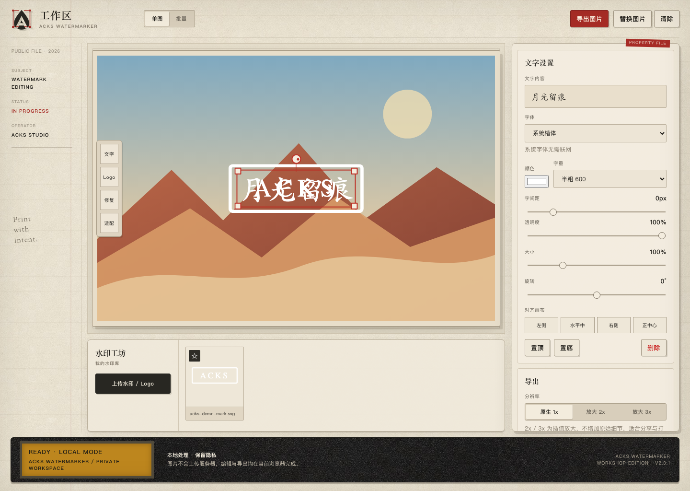
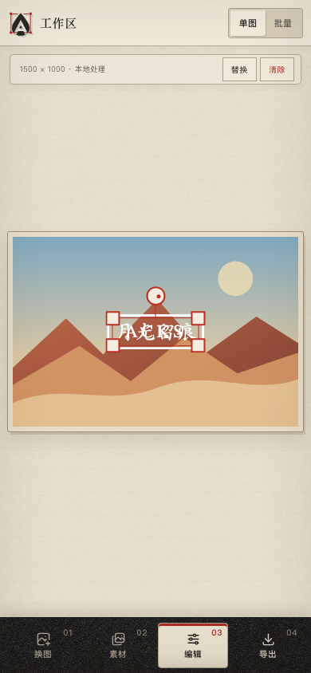

# ACKS Watermarker · 水印工坊

[中文](README.md) · [English](README.en.md)

   [](../../actions/workflows/ci.yml)

ACKS Watermarker 是一款注重隐私的浏览器图片水印工坊。它支持图片与文字水印、可视化拖拽编辑、手写字体、批量处理、本地轻量去背景与局部修复，并可导出 PNG、JPG 或 ZIP。图片处理和导出都在当前浏览器完成，不需要应用后端。



## 设计与使用体验

v2 采用温暖纸张、档案红和黑色金属构成的编辑台视觉语言。方案 3“裁切水滴”作为正式品牌标志：水滴代表水印，四角控制点对应选择、缩放与定位。桌面端保留完整的画布、素材带和属性面板；移动端则按真实任务顺序组织为四步导航：**导入图片 → 素材 → 编辑 → 导出**。

<p align="center">
  
</p>

## 功能简介

- **图片与文字水印**：添加 Logo、PNG、JPG、WebP、SVG 或文字水印。
- **直接编辑**：拖动、双指缩放、旋转、四角等比缩放、透明度调整、层级调整与快速对齐。
- **丰富字体**：系统字体、常用 Google Fonts，以及中英文手写字体和不同字重。
- **同源字体网关**：浏览器只请求当前站点；nginx 代为获取并缓存 Google Fonts，避免客户端直连 Google。
- **批量工作流**：建立统一模板、单张微调、全局调整，并导出 ZIP。
- **本地图像工具**：轻量去背景和邻近像素局部修复均在浏览器执行。
- **多格式导出**：PNG/JPG，支持 1x、2x、3x；导出时重新绘制图片，不保留原始 EXIF 或 C2PA 元数据。
- **会话恢复**：通过 IndexedDB 保存单图编辑状态；存储不可用时自动降级为本次会话内存模式。
- **响应式资源保护**：根据移动端与设备内存采用不同像素预算，减少浏览器崩溃风险。
- **无障碍基础**：键盘移动与删除、清晰焦点、ARIA 状态、减少动态效果支持。

## 技术栈

| 层级 | 技术 |
| --- | --- |
| 界面 | HTML5、CSS3、原生 JavaScript |
| 图像 | Canvas API、Blob/Object URL、Pointer Events |
| 本地存储 | IndexedDB |
| 字体 | Google Fonts CSS API，同源 nginx 代理与缓存 |
| 批量导出 | 内置无依赖 ZIP Store 编码器 |
| Web 服务 | nginx Alpine、Docker、Docker Compose |
| 测试 | Playwright、GitHub Actions |

项目运行时没有框架、数据库或应用后端。Node.js 只用于开发测试和文档截图生成。

## 项目结构

```text
.
├── index.html                 # 页面结构与样式
├── app.js                     # 编辑器状态、交互和导出逻辑
├── assets/                    # 本地界面纹理与品牌资产
├── nginx.conf                 # 静态站点、安全响应头、字体代理
├── Dockerfile
├── compose.yaml
├── tests/                     # Playwright 回归测试
├── scripts/                   # 品牌图标导出与文档截图
└── docs/screenshots/          # README 界面截图
```

## 本地部署

### 推荐：Docker Compose

Docker 方式包含完整的 Google Fonts 同源代理和生产安全响应头。

```bash
git clone <repository-url>
cd ACKS-Watermarker
docker compose up -d --build
docker compose ps
```

访问 <http://127.0.0.1:8080/>。

如果 8080 已被占用，可以指定其他仅本机监听的端口：

```bash
ACKS_PORT=8765 docker compose up -d --build
```

停止服务：

```bash
docker compose down
```

### 简单静态预览

适合只调试界面和系统字体：

```bash
python3 -m http.server 8765 --bind 127.0.0.1
```

访问 <http://127.0.0.1:8765/>。简单静态服务器不提供 Google Fonts 代理，因此在线字体不可用。

### 开发与测试

需要 Node.js 22 或兼容版本：

```bash
npm ci
npx playwright install chromium
npm test
```

品牌 SVG 更新后，可重新生成 favicon、Apple Touch Icon 和应用图标：

```bash
npm run brand:export
```

重新生成 README 截图时，先启动 Docker 服务，再运行：

```bash
ACKS_SCREENSHOT_URL=http://127.0.0.1:8080 npm run docs:screenshots
```

## 服务器部署

### Docker Compose

服务器需要 Docker、Docker Compose，以及到 `fonts.googleapis.com` 和 `fonts.gstatic.com` 的出站 HTTPS 连接。

```bash
git clone <repository-url>
cd ACKS-Watermarker
ACKS_PORT=8080 docker compose up -d --build
docker compose ps
```

Compose 默认只绑定 `127.0.0.1`，不会直接暴露到公网。建议由宿主机 nginx、Caddy 或其他反向代理提供 HTTPS。

### nginx 子路径示例

下面示例把应用发布在 `/watermark/`。请按自己的端口和域名调整：

```nginx
location = /watermark {
    return 301 /watermark/;
}

location /watermark/ {
    proxy_pass http://127.0.0.1:8080/;
    proxy_set_header Host $host;
    proxy_set_header X-Real-IP $remote_addr;
    proxy_set_header X-Forwarded-Proto $scheme;
}
```

应用使用相对路径，因此页面、纹理、脚本和字体代理都可以在子路径下正常工作。

### 更新与回滚

更新前记录当前提交和镜像 ID，并保留源代码备份：

```bash
git pull --ff-only
docker compose build
docker compose up -d
docker compose ps
docker compose exec watermarker nginx -t
```

部署后至少验证：首页、`app.js`、两张界面纹理、字体 CSS、字体文件和一次真实导出。重要环境建议保留旧镜像标签，以便失败时快速恢复。

## 使用指南

### 单图

1. 导入一张 PNG、JPG 或 WebP 图片。
2. 上传 Logo/水印素材，或输入文字并选择字体、字重与颜色。
3. 在画布上选中水印，拖动位置，使用手柄、滑块或对齐按钮调整。
4. 选择格式、倍率和 JPG 质量。
5. 导出图片并检查结果。

### 批量

1. 切换到“批量”并添加多张图片。
2. 选择一个或多个水印素材和布局预设。
3. 点击单张图片进行微调，或把该布局设为整批模板。
4. 调整全局透明度、大小和旋转。
5. 选择格式与倍率，导出 ZIP。

在线字体必须完成加载后才能导出。若字体加载失败，应用会停止导出，不会悄悄替换成其他字体。

## 隐私与安全

- 原图、水印素材、修复笔画和导出结果只存在于浏览器内存或 IndexedDB，不会提交给应用服务器。
- Google Fonts 请求经过同源 nginx 网关；代理会移除 Cookie、Referer、客户端转发 IP 和上游预连接头。
- 字体请求只包含字体家族和字重，不发送水印文字内容。
- 页面通过 CSP 禁止执行第三方脚本，并限制图片、字体和网络连接来源。
- 容器默认只监听本机回环地址，并启用只读根文件系统和 `no-new-privileges`。
- 请勿在公开 Issue 中上传私密原图、凭据或未脱敏截图。

## 浏览器支持

建议使用当前稳定版 Chrome、Edge、Safari 或 Firefox。超大图片、3x 导出和局部修复会消耗大量内存；应用会根据设备条件限制像素规模，但移动设备仍建议优先使用 1x。

## 参与贡献

请阅读 [CONTRIBUTING.md](CONTRIBUTING.md)。提交前运行 `npm test`，并确认没有加入私有图片、凭据、服务器地址或本地绝对路径。

## 问题反馈与安全报告

- 可复现的 Bug 与功能建议：[提交 Issue](../../issues)
- 一般反馈：<mail@jintao.uk>
- 安全漏洞：请遵循 [SECURITY.md](SECURITY.md)，不要公开披露。

## 开源协议

项目使用 [MIT License](LICENSE)。移动端导航图标来自 Tabler Icons，相关说明见 [THIRD_PARTY_NOTICES.md](THIRD_PARTY_NOTICES.md)。

版本变更记录见 [CHANGELOG.md](CHANGELOG.md)。
